# 可视化界面使用

本文档主要介绍如何启动并使用AgentSociety的可视化界面。

```{admonition} 在线平台
:class: tip

AgentSociety的在线平台为[https://agentsociety.fiblab.net](https://agentsociety.fiblab.net)，用户可以在此平台中使用AgentSociety进行模拟（需要支付大模型费用与机时费用）。
其使用体验与本地运行AgentSociety的可视化界面相同，但无需安装AgentSociety。
```

## 启动可视化界面

可视化界面的启动与[命令行运行](./03-code.md#cli)中所使用的配置文件中的`env`字段具有相同的配置项。

可视化界面配置文件包含以下主要参数：
- `addr`: 可视化界面的监听地址和端口
- `env.db.enabled`: 是否启用数据库功能
- `env.db.db_type`: 数据库类型（如SQLite、PostgreSQL等）
- `env.home_dir`: AgentSociety数据存储目录，包括sqlite数据库文件、HuggingFace模型文件、通过可视化界面管理的各类数据等，默认存储在当前目录下的`agentsociety_data`文件夹

```yaml
addr: 127.0.0.1:8080
env:
  db:
    enabled: true
    db_type: sqlite
  home_dir: ./agentsociety_data
```

假设配置文件存储为`./ui.yaml`，则可以通过以下命令启动可视化界面：
```bash
agentsociety ui -c ./ui.yaml
```

启动后，可以在浏览器中访问`http://127.0.0.1:8080`，进入可视化界面。

```{admonition} 提示
:class: note

可视化界面中填入的`addr`代表在程序所运行的机器上的监听地址与端口，如果浏览器不运行在相同的机器上，请使用端口转发等网络技术实现对远程服务器的访问。
```

另外，如果可视化界面启动时所设定的数据库配置、`home_dir`等配置与编程使用方式中所使用的配置相同，则可视化界面中将能够加载并查看通过编程使用方式模拟的结果。

## 可视化界面功能

AgentSociety可视化界面提供运行模拟实验所需的各项配置的可视化配置功能，包括：
- **LLM**：配置模拟过程中使用的大语言模型 API 服务
- **地图**：导入和管理模拟所需的地图数据
- **智能体**：导入和管理智能体画像、智能体模板、用于运行实验的智能体配置
- **工作流**：配置仿真实验的流程、环境参数等核心设置
- **实验**：展示所有已完成的实验记录。点击具体实验可进入详细交互页面，用于查看和分析实验结果。

```{admonition} 提示
:class: note

AgentSociety可视化界面中配置的各项内容，与编程使用方式中的配置项具有相同的含义，用户可以参考[实验配置](../03-config)了解各项配置的含义。
```

### LLM API配置页

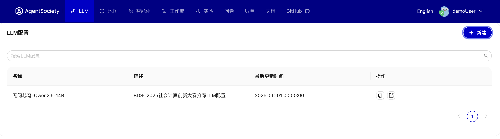 

在LLM配置列表页面中，可以：
- 浏览所有已配置的LLM API
- 通过`操作`栏目对现有配置进行编辑、复制、删除、导出等操作
- 通过右上角`+ 新建`按钮的添加新的LLM API配置


其中，新建LLM API配置的页面如下：
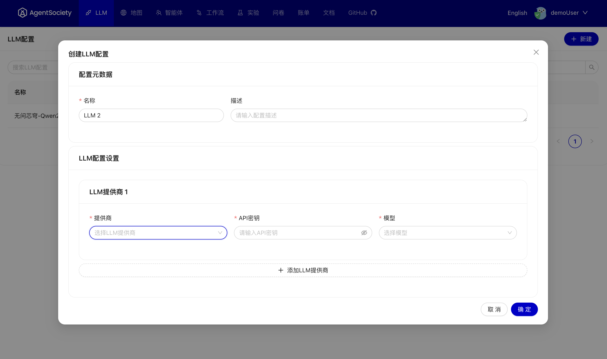 

创建新的LLM API配置需要完成以下步骤：

1. 选择LLM API服务提供商
2. 配置API密钥
3. 选择模型版本

```{admonition} 重要提示
:class: warning
由于AgentSociety实验需要使用大量的大模型 API 访问，一般的 API 服务可能难以满足高并发需求。建议：
- 根据实验规模选择匹配吞吐量的 API 服务
- 配置多个 API 密钥实现负载均衡
- 考虑使用企业级 API 服务以获得更高的调用限额
```

### 地图配置页

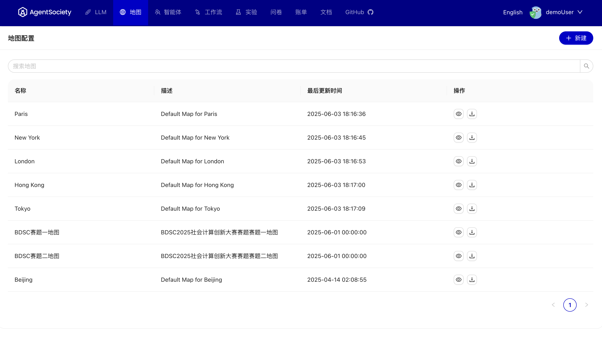 

可视化界面支持上传、下载和预览地图功能，地图数据来源参见[自定义地图](../02-development-guide/03-map.md)文档。

```{admonition} 提示
:class: note

预览地图将跳转到[MOSS](https://moss.fiblab.net/)平台，该平台提供了一个纯浏览器环境的地图查看与编辑器。
```

### 智能体配置页

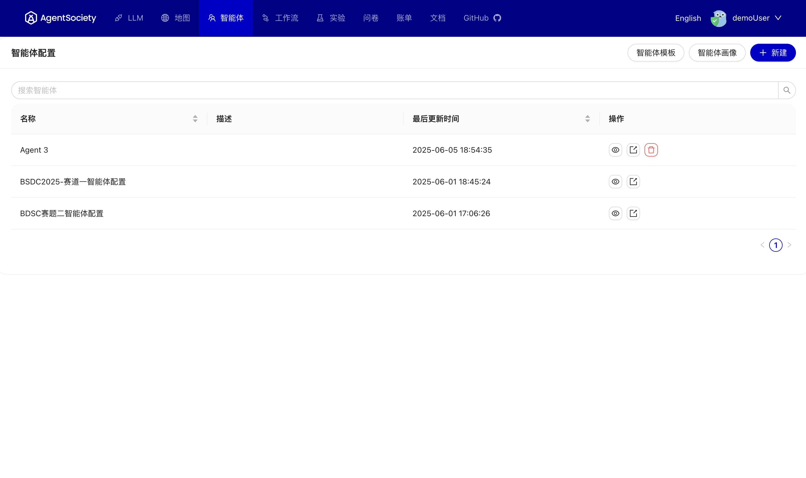

智能体是AgentSociety中最关键的组成部分，承载着虚拟社会中各种虚拟角色的行为和交互逻辑。
智能体的配置在可视化界面中被区分为三部分：
- 智能体画像文件管理
- 智能体模板管理
- 智能体配置管理

#### 智能体画像文件管理

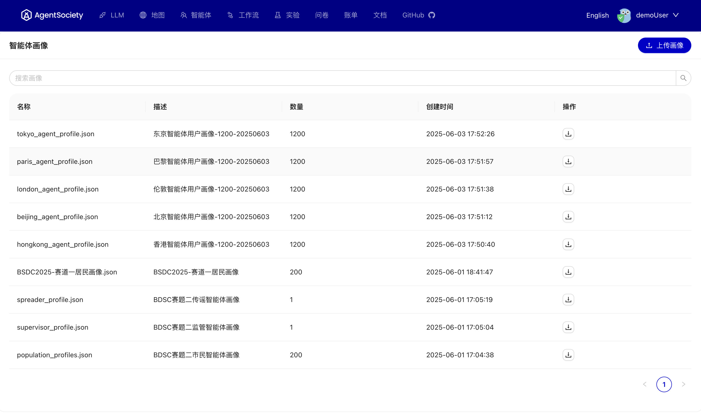

智能体画像是对虚拟世界中创建的每一个市民智能体的信息描述，包括姓名、性别、年龄、教育水平、职业、婚姻状况、人格角色、背景故事等内容，这些信息构成了智能体的自我认知，是智能体进行一切行为和决策的基础。

智能体画像文件需要在本地构建，其格式参见[智能体画像](../02-development-guide/02-profile.md)文档。

智能体画像文件管理页面支持上传与下载智能体画像。

#### 智能体模板管理


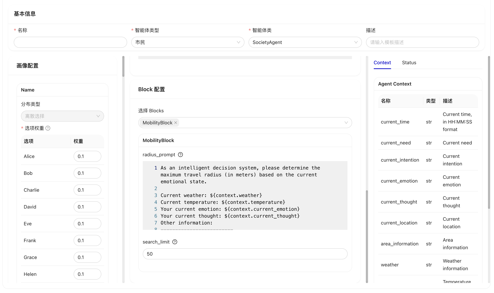

AgentSociety中的智能体设计分为`Block-Agent`两个层次结构，`Agent`负责协调和管理多个`Block`，而每个`Block`专注于实现特定的功能，通过`Agent`组合不同的`Block`可以实现复杂的智能体行为。
另外，`Agent`与`Block`都支持设置一系列参数来控制其执行行为。
这些功能可以在[智能体开发](../02-development-guide/04-agent.md)文档中找到详细说明。

为了帮助用户更方便地配置智能体（`Agent`与`Block`的组合），AgentSociety提供了智能体模板管理功能，使得用户可以通过可视化界面配置智能体模板。
智能体模板配置过程中，需要：
1. 选择智能体类型；
2. 选择智能体类（即选择`Agent`的实现）；
3. 配置智能体类中预设的参数；
4. 选择智能体中包含的`Block`；
5. 配置`Block`中预设的参数；
6. 保存智能体模板。

智能体模板管理页面支持对智能体模板的新增、查看、导出、删除等常见的管理功能。

```{admonition} 智能体开发
:class: note

[智能体开发文档](../02-development-guide/04-agent.md)中介绍了AgentSociety中智能体的开发流程，包括智能体的概念、设计与实现逻辑。
```

#### 智能体配置

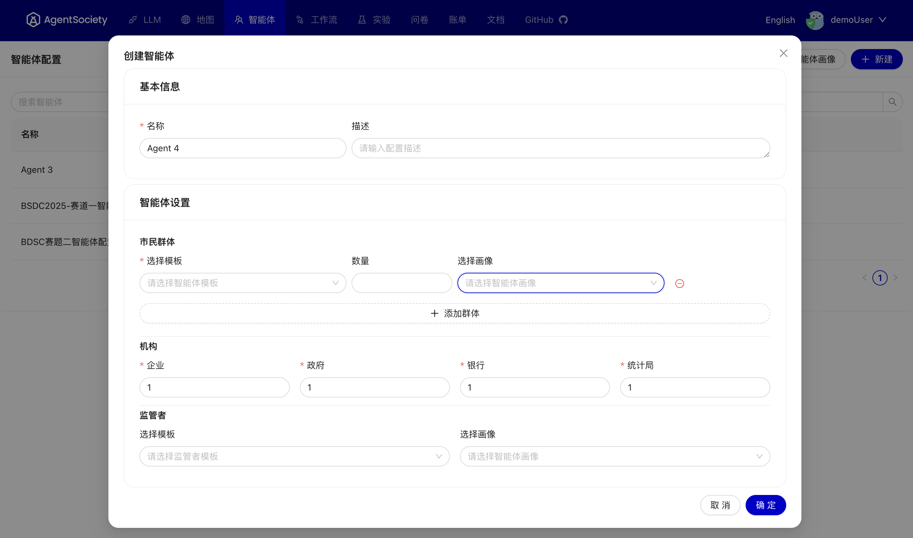

可用于启动实验的智能体配置是一组“智能体模板 + 智能体画像”的组合。
智能体模板对智能体的运行逻辑、LLM提示词等进行了定义，为智能体在虚拟世界中的行为提供了基本的框架。
而智能体画像进一步为每个智能体提供了包括背景故事在内的丰富的人物信息，将智能体模板中的抽象概念具象化。

因此，在智能体配置页面中，用户可以添加多个“智能体模板 + 智能体画像”的组合来完成配置。
经济相关的企业、政府、银行、统计局提供简单的数量配置。

与其他配置页面类似，智能体配置页面也支持新增、查看、导出、删除等常见的管理功能。

### 工作流配置

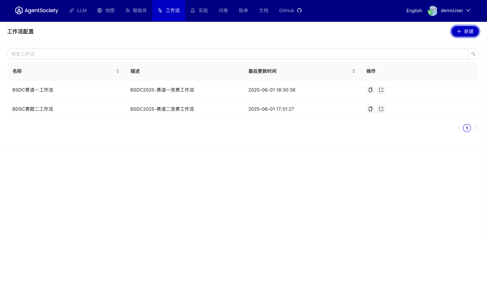

工作流定义了仿真实验的流程。
通过工作流，可以控制仿真进度、进行干预并收集实验数据。

```{admonition} 什么是实验？
:class: note

实验是AgentSociety中用于模拟仿真的核心概念，实验配置定义了仿真实验的流程、环境参数等核心设置。
关于实验的详细说明参见[实验设计](../02-development-guide/01-experiment.md)文档。
```

工作流配置管理页面提供对工作流配置的查看、编辑、复制、删除和导出。

其中，创建新的工作流是界面的主要功能：

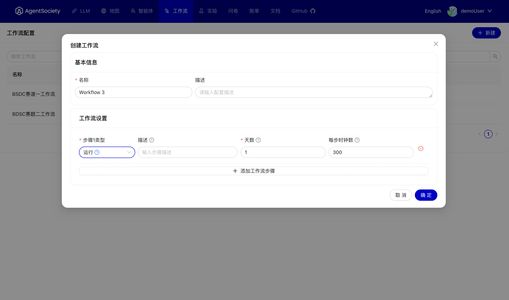

创建新的工作流需要完成以下步骤：
1. 输入工作流名称和描述信息
2. 循环以下的流程
   - 添加步骤
   - 根据实验需求选择相应的步骤类型
   - 配置节点参数：根据所选步骤类型填写相应的配置参数，具体字段含义参考[实验配置-工作流步骤类型](../03-config/05-exp.md#workflowstep)文档
3. 保存

### 实验管理

#### 创建实验

实验创建界面如下图所示：
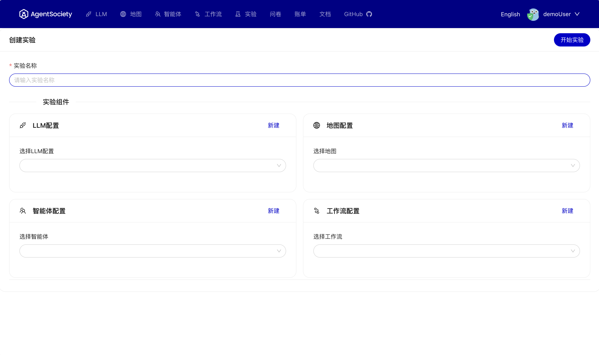

要启动实验，需要提前配置好以下四个配置项：
- LLM配置
- 地图配置
- 智能体配置
- 工作流配置

完成所有四个配置项的选择后，点击`开始实验`按钮来启动实验。
所有配置将被发送到可视化界面程序，并在启动可视化界面程序的机器上以独立进程的方式运行，运行过程中的进程ID、日志等信息会被存储在可视化界面配置的`home_dir`下的`webui/executor`文件夹中。

模拟进程启动成功后，页面会自动跳转到实验管理页面以便监控实验的运行状态。

## 实验管理

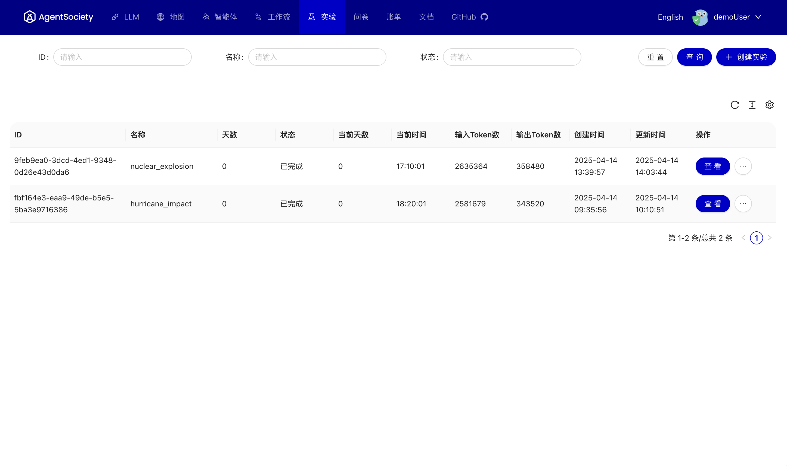

在实验管理页面中，可以查看数据库中记录的所有实验的运行情况以及所消耗的LLM Token，同时操作栏提供丰富的实验管理功能：
- `查看`：进入实验结果的可视化界面，可以观察智能体的移动轨迹、状态变化、内心活动、智能体间的对话等，并可以查看全局指标变化
- `详情`：查看实验的启动配置、运行报错等详细信息
- `查看日志`：查看实验的运行日志
- `导出产物`：导出通过`save_context`机制保存的数据，该机制主要通过编写特定的代码实现，也可通过[实验配置-保存智能体上下文](../03-config/05-exp.md#save_context)触发。
- `全部导出`：导出模拟过程中写入数据库的所有内容以便开展数据分析，包括每个模拟时刻下的智能体状态、智能体对话、全局提示词等，详细内容参见[数据分析](../02-development-guide/05-data-analysis.md)文档。
- `删除`：从数据库中删除实验的所有相关数据

如果通过`查看`按钮进入可视化界面后，可以以直观的方式观察智能体的移动轨迹、状态变化、内心活动、智能体间的对话等。


如果点击智能体头像，则可以与查看该智能体更为详细信息并与其进行交互：
- 对特定智能体进行访谈
- 向智能体发送调查问卷并收集他们的回答

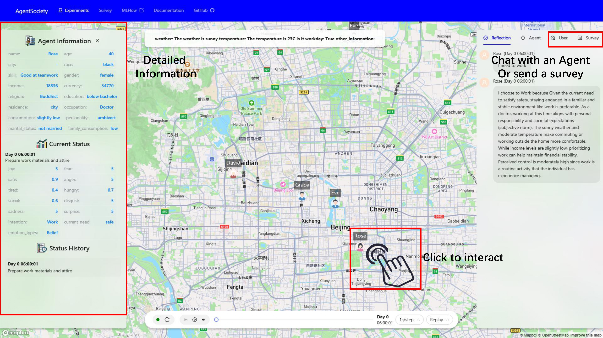
