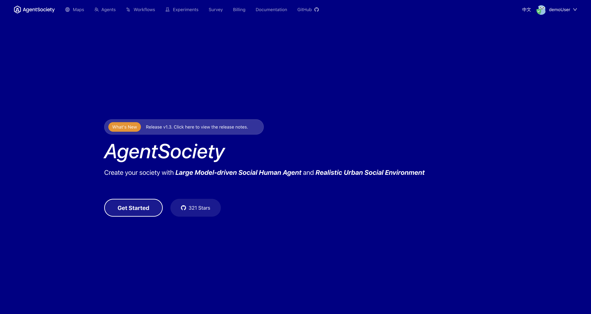

# UI Home Page

The home page shown in the listening address lists all the simulation recorded in your deployed PostgreSQL DSN. 

 

There are several function buttons on the top left.

- `Map`: The Map section allows users to import maps used during the simulation. We provide maps for several cities. If you need to create a custom map, you can visit [https://moss.fiblab.net/](https://moss.fiblab.net/) to make your own map.
- `Agent`: The Agent section allows users to upload profiles for agents. We provide sample profiles for agents from several cities. Users can also create templates for agents and build agents based on intelligent entities from the community.
- `Workflow`: The Workflow section outlines the sequence of actions and processes that occur during the simulation. It helps users understand how different components interact with each other.
- `Experiment`: The Experiment section displays all conducted experiments. Click on an experiment to jump to the detailed interaction page, where you can view and analyze the results.
- `Survey`: The Survey section allows users to create and manage surveys for agents within the simulation. This feature helps gather feedback and data from the agents.
- `Billing Online`: The Billing Online section provides information about the costs associated with using the online platform, including details on API usage and server rental fees.