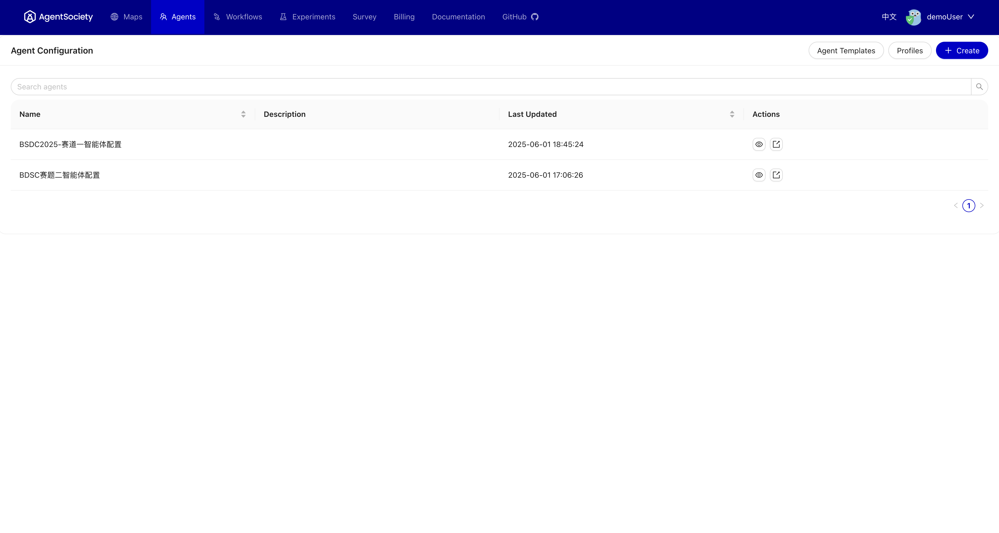
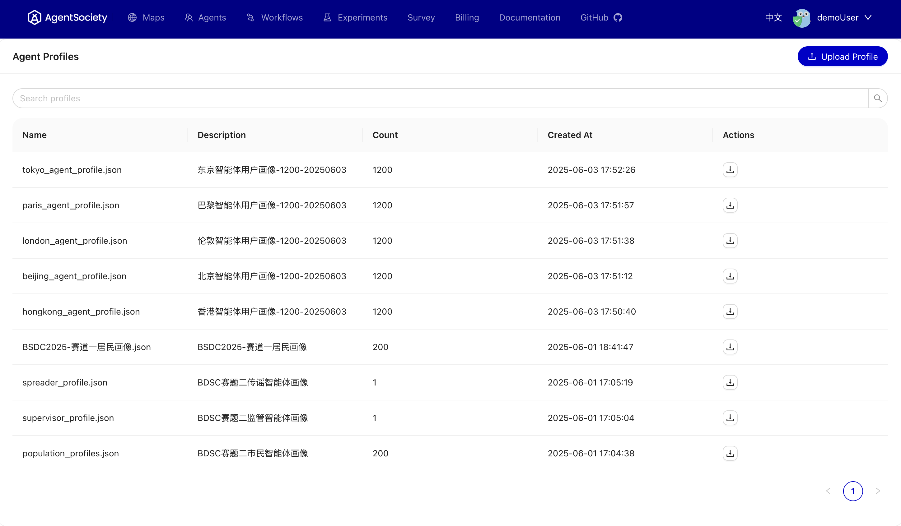
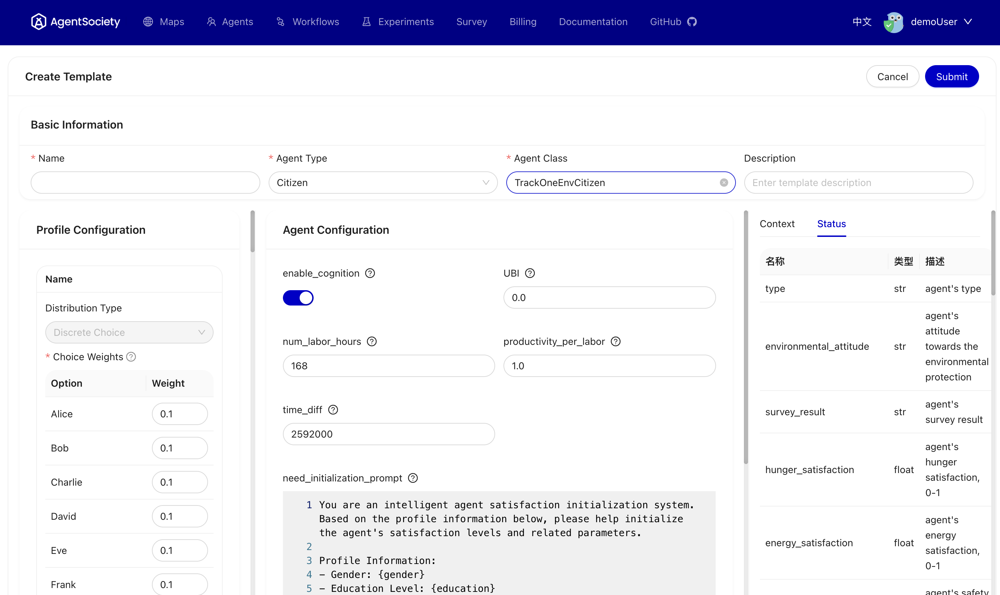
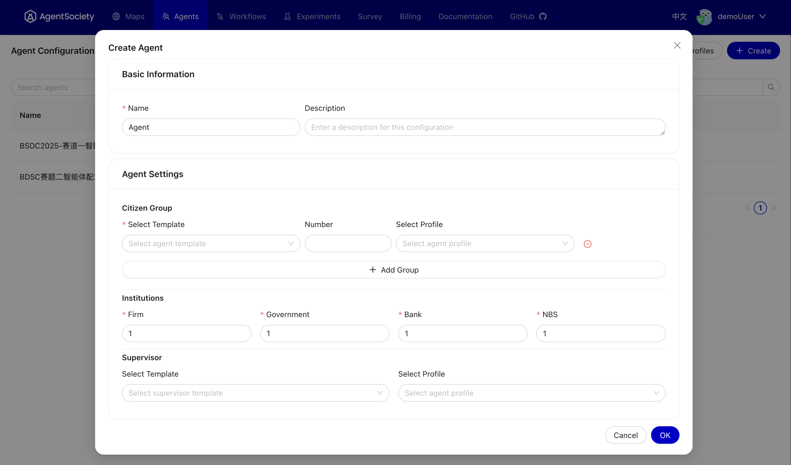

# Agent

## Overview
This section provides an overview of the Agent functionality, including how to upload profiles and create templates. Users can build overall agent configurations based on these elements.

 

## Uploading Profiles
Users can upload their own profiles, and we also provide sample profiles for several cities on our online platform. If you are deploying locally, you can download profiles from the online platform.

 

## Creating Templates
Guidelines on how to create templates for agents and the benefits of using templates. We provide multiple template examples for users to reference.

 

Users can also create their own templates, which can be shared through the community. If you are deploying the service locally, you will need to install the community package using `pip install agentsociety-community`.

 

## Building Agents
Finally, users can create overall agent configurations using the profiles and templates mentioned above.

 

