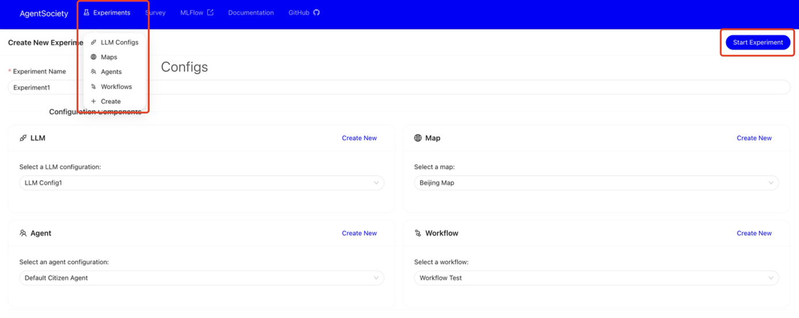
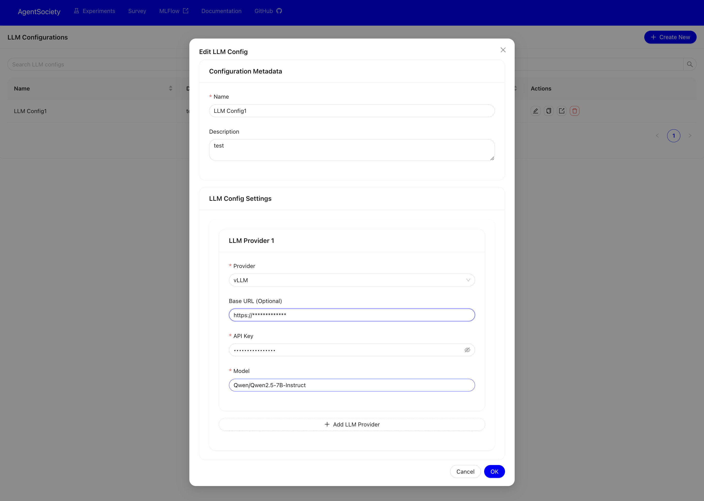

# Create Experiment on UI

To start an experiment through the web interface, the configured form on the webpage is sent to the backend, which then creates containers and launches the experiment based on the form content.

Before starting an experiment via the web interface, you need to first clone the whole repository and build the required Docker image by running `scripts/build_docker.sh`:
  ```bash
  bash ./scripts/build_docker.sh
  ```

```{admonition} Hint
:class: hint
We will provide a pre-built Docker image in the future. Linux x64 will be first supported (used in Linux x64 and WSL2 platforms).
```

The experiment creation interface is shown in the figure below:


Click the `Create` button shown in the figure to initiate a new experiment.

To start an experiment, you need to configure the following four forms:
- LLM Config
- Map Config
- Agent Config
- Workflow Config

After completing the selection of all four configuration forms, click the `Start experiment` button to launch your experiment.

To fill out the configuration forms, you can either click the `Create New` button or select a specific form button in the top left corner to create a new configuration.

Taking the LLM Config form as an example, as shown below:

You'll need to complete the form by specifying your LLM service provider, entering your API key, and selecting the appropriate model type among other configuration options.

After starting your experiment, the page will automatically redirect to the Experiment page where you can monitor the experiment's running status. For more details, please refer to [UI Home Page](./02-ui-introduction.md).
Once the experiment is completed, you can use the Goto button to view detailed information and progress.


The web-based experiment launch functionality is still under development.
Future work plans include:
- Enriching configurable options
- UI improvements 
- Better experiment management
- Clearer error message display
